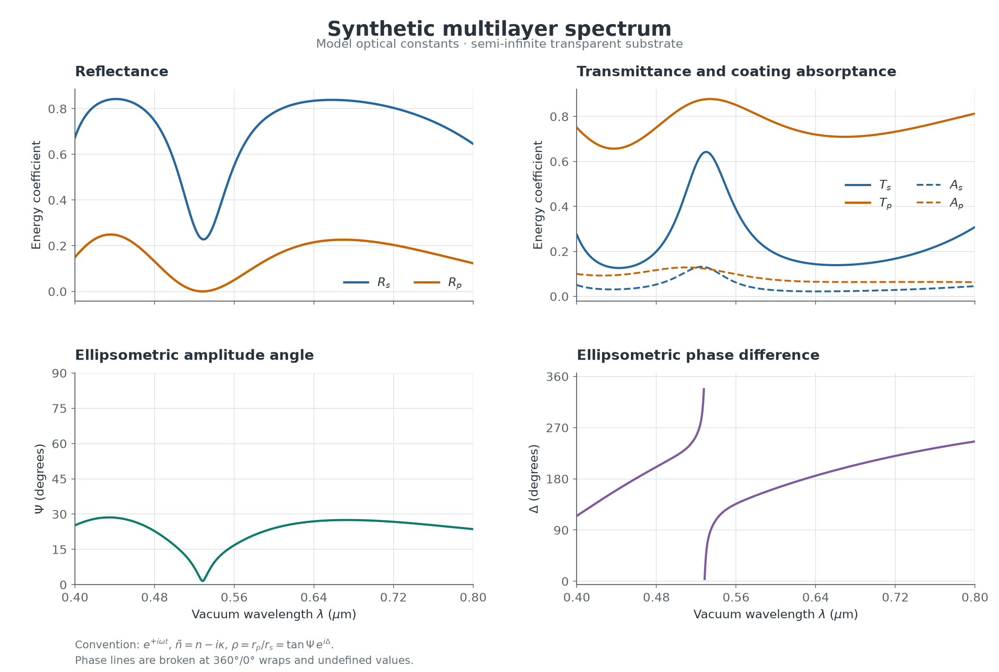

# Direct Problem

Прямая задача оптики многослойных покрытий: документированный алгоритм и эталонное расчётное ядро на Python/NumPy.

Для N однородных изотропных немагнитных слоёв вычисляются спектры Rs, Rp, Ts, Tp, поглощение покрытия, комплексные амплитуды, эллипсометрическое отношение rho и углы Psi, Delta при наклонном падении. В слоях допускаются дисперсия и поглощение. Подложка полубесконечная и непоглощающая; её действительный показатель может иметь дисперсию.

## Документы и материалы

- [Теория, вывод формул и псевдокод](multilayer_optics/THEORY_RU.md)
- [Руководство, API и примеры использования](multilayer_optics/README_RU.md)
- [Результаты 44 выполненных тестов](multilayer_optics/VALIDATION_RU.md)
- [Исходный промпт с уточнёнными условиями](docs/REQUEST_PROMPT_RU.md)
- [Книга: Furman, Tikhonravov — Basics of Optics of Multilayer Systems](reference/book_Furm_Tikh.pdf)
- [Модельный спектр CSV](multilayer_optics/example_spectrum.csv) и [JSON](multilayer_optics/examples/example_spectrum.json)

## Запуск

Требуются Python 3.10+ и NumPy 1.24+.

```bash
python -m pip install ./multilayer_optics
python -m unittest discover -s multilayer_optics/tests -v
python multilayer_optics/example.py
```

Рабочее временное соглашение: exp(+i*omega*t), показатель слоя n-i*kappa. Для отражённого p-базиса r_p=-r_tan_p; rho=r_p/r_s. Все соглашения, единицы и маски недостоверной фазы документированы и включены в экспорт результата.

Реализация использует устойчивую рекурсию масштабированных блоков рассеяния и сохраняет log(T) при очень малом пропускании. Проверены критические углы, полное внутреннее отражение, 1500 слоёв и независимый интеграл поглощения. Точный epsilon=0 для p-поляризации при ненормальном падении возвращает явную диагностику; повышенная точность арифметики не реализована.

## Пример спектра

Пять модельных диспергирующих слоёв; угол 60 градусов. Оптические константы синтетические.



Релиз: **Direct Problem**. Git-тег: `Direct-Problem`.
